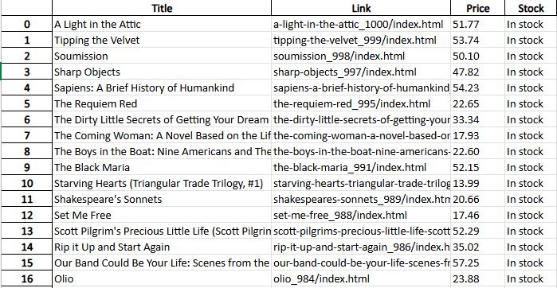

# data-scraper
In this project I learned or solidified the following skills
- [x] Libraries in Python, mainly PD, Beautifulsoup and Request
- [x] Data structures
- [x] Using html attribute and class to find correct data with Beautifulsoup

As a disclaimer I do not support the malicious use of data scraping to steal private information. Data scraping should be only used when adhearing to a websites terms of service policies and for the greater good.

## using the program
1. To begin use of data-scraper you must first install the dependant libraries which are Panda, Beautifulsoup, and Request. 

1. Copy/Paste your desired website link to the URL variable (there are many websites specifically created to test data scrapers)

1. Change the .find html attributes and classes to the specific data you need to gather on the website

1. Set the file type you want to save the data too it will be saved to the folder the repo was cloned too

### final product 

## final thoughts
Working on a data scraper especially in a language I have not used in a long time since I mainly use C++ in school was awesome! Not only do I feel like I have a better understanding of how large companys gather information online. But also feels pretty cool knowing you can load up a website and quickly gather need information into an excel sheet instead of spending 10 hours doing it manually. I really enjoyed programming in Python I intiailly did not when I first started programming because I like to know the "why" behind the function and python just gives you the final answer so as a beginner it didn't work but with so many hours using C++ creating almost all my functions manually getting a feel for why and how, this was refreshing.